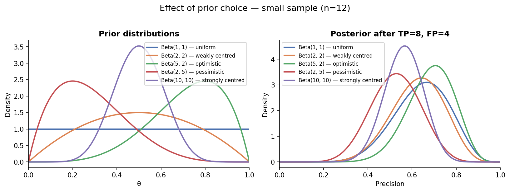

# Bayesian Precision–Recall

[](https://pypi.org/project/bayesian-precision-recall/)

Precision and recall are point estimates on a finite test set — they carry uncertainty.
This library models that uncertainty using **Beta-Binomial conjugate models**, giving you full
posterior distributions for precision, recall, and F1 rather than single numbers, based on
[Goutte & Gaussier (2005)](https://link.springer.com/chapter/10.1007/978-3-540-31865-1_25).

```
precision = TP / (TP + FP)  →  Beta(α + TP,  β + FP)   [exact, closed-form]
recall    = TP / (TP + FN)  →  Beta(α + TP,  β + FN)   [exact, closed-form]
F1                          →  Monte Carlo over the joint posterior
```

---

## Why this matters

| Point-estimate thinking | Bayesian posterior |
|---|---|
| Precision = 0.75 | Precision ∈ [0.66, 0.83] with 95% confidence |
| "Is 75% above our 65% floor?" | "P(true precision > 65%) = 98.8%" |
| "Model A is better than B" | "P(A precision > B precision) = 86%" |
| Results brittle on small test sets | Uncertainty widens automatically |
| No principled way to use prior knowledge | Beta prior encodes domain expertise |

The same point estimate can reflect very different situations:

- **class_A**: TP=80, FP=26 → precision ≈ 75.5%, 95% CI = [66%, 83%] — a reliable estimate.
- **class_B**: TP=5, FP=6 → precision ≈ 45.5%, 95% CI = [21%, 72%] — too uncertain to act on.

Comparing bare point estimates across different sample sizes is misleading.
The Bayesian model makes that difference explicit and quantifiable.

---

## Installation

```bash
pip install bayesian-precision-recall
```

Or from source:

```bash
git clone https://github.com/your-org/bayesian-precision-recall.git
cd bayesian-precision-recall
pip install -e .
```

**Requirements:** Python ≥ 3.9, numpy, scipy, matplotlib

---

## Quick start

```python
from bayesian_pr import BayesianPRModel

model = BayesianPRModel(model_name="classifier_v2", sample_dist_name="test_set")
model.update(tp=80, fp=26, fn=20)
print(model.summary())
```

```
BayesianPRModel: classifier_v2 [test_set]
  Prior       : Beta(1.0, 1.0)
  Observations: TP=80, FP=26, FN=20
  Precision   : mean=0.7500, std=0.0415, 95% CI=[0.6646, 0.8267]
  Recall      : mean=0.7941, std=0.0398, 95% CI=[0.7109, 0.8664]
  F1 (MC)     : mean=0.7703, std=0.0291, 95% CI=[0.7106, 0.8248]
```

`fp` and `fn` are independently optional — only the metrics whose counts have been provided are available:

```python
# Precision only
model = BayesianPRModel(model_name="cls")
model.update(tp=80, fp=26)
model.precision_stats()   # ✓
model.recall_stats()      # raises ValueError: no fn observations provided

# Recall only
model = BayesianPRModel(model_name="cls")
model.update(tp=80, fn=20)
model.recall_stats()      # ✓
model.precision_stats()   # raises ValueError: no fp observations provided
```

---

## Core API

### `BayesianPRModel`

```python
BayesianPRModel(
    model_name:       str   = "model",
    sample_dist_name: str   = None,      # optional — used for warnings in compare/transfer
    prior_alpha:      float = 1.0,       # Beta prior α  (uniform by default)
    prior_beta:       float = 1.0,       # Beta prior β
    n_samples:        int   = 100_000,
)
```

| Method / Property | Returns | Requires | Description |
|---|---|---|---|
| `.update(tp, fp=None, fn=None)` | `self` | `fp` or `fn` | Accumulate observations (chainable) |
| `.reset()` | `self` | — | Clear observations, keep prior |
| `.has_precision` | `bool` | — | True if fp has been provided |
| `.has_recall` | `bool` | — | True if fn has been provided |
| `.has_f1` | `bool` | — | True if both fp and fn have been provided |
| `.precision_posterior` | `scipy.stats.beta` | fp | Beta posterior for precision |
| `.recall_posterior` | `scipy.stats.beta` | fn | Beta posterior for recall |
| `.precision_stats(ci=0.95)` | `PosteriorStats` | fp | Mean, std, credible interval |
| `.recall_stats(ci=0.95)` | `PosteriorStats` | fn | Same for recall |
| `.f1_stats(ci=0.95)` | `PosteriorStats` | fp + fn | Monte Carlo F1 posterior |
| `.f1_samples()` | `np.ndarray` | fp + fn | Raw MC samples for custom analysis |
| `.prob_above_threshold(t, metric)` | `float` | fp / fn / both | P(true metric > t) |
| `.summary(ci=0.95)` | `str` | — | Prints only available metrics |

### `prob_above_threshold`

```python
# Does this classifier confidently clear the precision floor?
model.prob_above_threshold(threshold=0.65, metric="precision")
# → 0.988   # large sample, point estimate well above floor

# Same question, only 11 predictions behind it:
sparse_model.prob_above_threshold(threshold=0.65, metric="precision")
# → 0.085   # too uncertain — acquire more labels
```

The same 70% point estimate on different sample sizes:

| n predictions | P(precision > 65%) |
|---|---|
| 10  | 57% |
| 50  | 75% |
| 100 | 84% |
| 200 | 93% |
| 500 | 99% |

Confidence comes from volume, not from the rate itself.

### `compare_models`

Intended for comparing two **different models** on the **same data distribution**. Emits a warning if `model_name` fields match or `sample_dist_name` fields differ.

```python
from bayesian_pr import compare_models, Metric

result = compare_models(model_a, model_b, metric=Metric.PRECISION)
# {
#   "prob_a_better": 0.859,
#   "mean_diff":     +0.042,
#   "ci_low":        0.008,
#   "ci_high":       0.076,
#   "model_a":       "classifier_v2 [test_set]",
#   "model_b":       "classifier_v1 [test_set]",
#   "metric":        "precision",
# }
```

### `transfer_test`

Tests whether the **same model** produces consistent posteriors across **two different data distributions**. Conceptually a one-sample location test framed in terms of the Bayesian posteriors: the posterior mean from the reference distribution (μ_ref) is treated as a fixed point and its tail probability under the evaluation distribution's posterior is measured.

```python
from bayesian_pr import transfer_test, Metric

result = transfer_test(model_ref, model_eval, metric=Metric.PRECISION)
# {
#   "mu_ref":       0.794,
#   "mu_eval":      0.381,
#   "delta":        +0.413,
#   "S":            0.0000,
#   "inconsistent": True,
#   "model_ref":    "cls [dist_A]",
#   "model_eval":   "cls [dist_B]",
#   "metric":       "precision",
# }
```

`S = min(F_eval(μ_ref), 1 − F_eval(μ_ref))`. Small S (≤ 0.05) indicates the two posteriors are statistically inconsistent. F1 is not supported as it has no closed-form CDF.

---

## Prior sensitivity

The Beta prior encodes beliefs before seeing any data. The two hyperparameters
(α, β) represent pseudo-counts of successes and failures respectively. With little
data the choice of prior matters; with large samples the posterior is dominated by
observations regardless of the prior.



Each curve shows how a different prior (α, β) shapes the posterior after the same
observations (TP=8, FP=4). Weakly informative priors (e.g. `Beta(1,1)` — uniform)
let the data speak; stronger priors require more data to be overcome. The `plot_prior_sensitivity`
visualization lets you audit this effect for your own observation counts.

---

## Visualization

All plot functions return a `matplotlib.Figure`.

```python
from bayesian_pr.visualization import (
    plot_posteriors,          # PDF for precision, recall, F1
    plot_sequential_update,   # Posterior evolution as observations arrive
    plot_comparison,          # Overlay + forest plot across multiple models
    plot_prior_sensitivity,   # Effect of different priors at low vs high N
)

fig = plot_posteriors(model, ci=0.95)
fig.savefig("posteriors.png", dpi=150, bbox_inches="tight")
```

---

## Examples

| File | What it demonstrates |
|---|---|
| [01_basic_usage.py](examples/01_basic_usage.py) | Fit a model, print the posterior summary, plot the distributions |
| [02_prob_above_threshold.py](examples/02_prob_above_threshold.py) | `prob_above_threshold` across classes and sample sizes |
| [03_model_comparison.py](examples/03_model_comparison.py) | Compare candidate vs. baseline via `compare_models` |
| [04_production_transfer.py](examples/04_production_transfer.py) | Stable / inconclusive / distribution-shift scenarios with `transfer_test` |

---

## Mathematical background

Both precision and recall are Bernoulli success rates, so the natural model is Beta-Binomial:

```
likelihood:  TP | n, θ  ~  Binomial(n, θ)
prior:       θ          ~  Beta(α, β)
posterior:   θ | TP, n  ~  Beta(α + TP, β + n − TP)
```

For **precision**, `n = TP + FP` and `successes = TP`.  
For **recall**, `n = TP + FN` and `successes = TP`.  
Beta is the conjugate prior of the Binomial, so the posterior stays in the Beta family — no MCMC needed.

With an uninformed (uniform) prior `Beta(1, 1)`, the posterior **mode** equals the observed metric:

```
mode = (α + TP − 1) / (α + TP + β + FP − 2)
     = TP / (TP + FP)   when α = β = 1
```

This means the Bayesian estimate recovers the classical point estimate as a special case, while the full posterior additionally quantifies uncertainty around it.

**F1** has no closed-form posterior — estimated via Monte Carlo over joint samples:

```python
p_samples  = Beta(α_p, β_p).sample(N)
r_samples  = Beta(α_r, β_r).sample(N)
f1_samples = 2 * p * r / (p + r)
```

**`transfer_test`** treats the reference-distribution posterior mean (μ_ref) as a fixed point
and measures its tail probability under the evaluation-distribution posterior:

```
S = min( F_eval(μ_ref),  1 − F_eval(μ_ref) )
```

`F_eval` is the Beta CDF for the evaluation posterior, evaluated analytically.
`S ≤ 0.05` → μ_ref sits in a thin tail of the evaluation posterior → the posteriors are
statistically inconsistent. F1 is not supported as it has no closed-form CDF.

